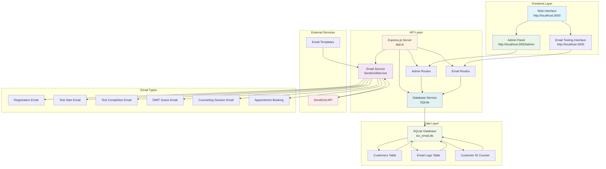
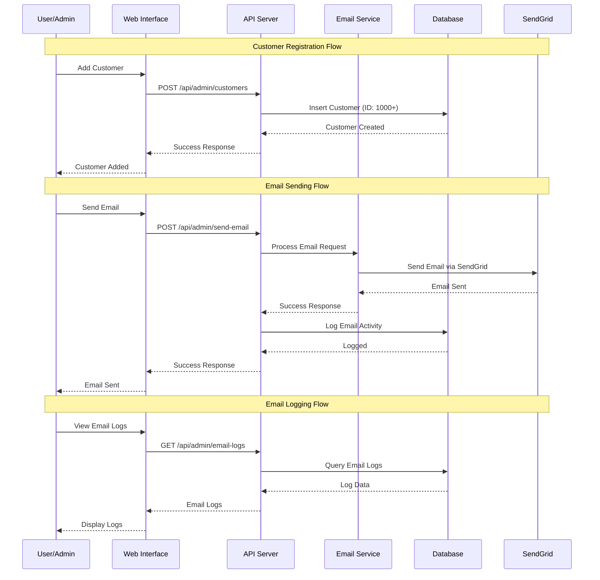

# 🧠 BCI Email Service

A comprehensive email service for Brain Computer Interface (BCI) applications, providing automated email notifications for various stages of the testing and counseling process.

## 📋 Table of Contents

- [System Overview](#system-overview)
- [System Architecture](#system-architecture)
- [Features](#features)
- [Installation](#installation)
- [Configuration](#configuration)
- [Usage](#usage)
- [API Endpoints](#api-endpoints)
- [Database Schema](#database-schema)
- [Admin Interface](#admin-interface)
- [Testing](#testing)

## 🏗️ System Overview

The BCI Email Service is a Node.js application that provides automated email notifications for BCI testing workflows. It supports multiple email types including registration confirmations, test notifications, completion reports, and counseling session management.

## 🏛️ System Architecture



## 🔄 Data Flow Diagram



## ✨ Features

### 📧 Email Types
- **Registration Email**: Welcome emails with user codes and test information
- **Test Start Email**: Notifications with test start and resume URLs
- **Test Completion Email**: Results ready notifications with report URLs
- **DMIT Scans Email**: Confirmation of scan collection
- **Counseling Session Email**: Session scheduling, rescheduling, and cancellation
- **Appointment Booking**: Simple appointment confirmations

### 🔧 Admin Features
- **Manual Email Sending**: Send any email type through the admin interface
- **Customer Management**: Add and view customers with auto-generated IDs (starting from 1000)
- **Email Logging**: Complete audit trail of all sent emails
- **Statistics Dashboard**: Email success rates and usage statistics
- **Real-time Monitoring**: View email status and customer information

### 🗄️ Database Features
- **Customer Tracking**: Unique customer IDs with display names and emails
- **Email Logging**: Comprehensive logging of all email activities
- **Status Tracking**: Success/failure status for each email
- **Audit Trail**: Timestamps and error messages for debugging

## 🚀 Installation

1. **Clone the repository**
   ```bash
   git clone <repository-url>
   cd bci_mail
   ```

2. **Install dependencies**
   ```bash
   npm install
   ```

3. **Set up environment variables**
   ```bash
   cp .env.example .env
   # Edit .env with your SendGrid API key and from email
   ```

4. **Start the server**
   ```bash
   npm start
   # or
   node app.js
   ```

## ⚙️ Configuration

Create a `.env` file with the following variables:

```env
SENDGRID_API_KEY=your_sendgrid_api_key_here
FROM_EMAIL=your_verified_sender@domain.com
PORT=3000
```

## 📖 Usage

### Web Interface
- **Main Interface**: http://localhost:3000
- **Admin Panel**: http://localhost:3000/admin

### API Usage
```bash
# Health check
curl http://localhost:3000/api/health

# Add customer
curl -X POST http://localhost:3000/api/admin/customers \
  -H "Content-Type: application/json" \
  -d '{"displayName":"John Doe","email":"john@example.com"}'

# Send email
curl -X POST http://localhost:3000/api/admin/send-email \
  -H "Content-Type: application/json" \
  -d '{"displayName":"John Doe","recipientEmail":"john@example.com","emailType":"registration","usercode":"ABC123","testType":"psychometric"}'
```

## 🔌 API Endpoints

### Public Endpoints
- `POST /book` - Original appointment booking
- `GET /` - Main web interface
- `GET /admin` - Admin panel

### Email API Endpoints
- `POST /api/email/registration` - Registration email
- `POST /api/email/test-start` - Test start email
- `POST /api/email/test-completion` - Test completion email
- `POST /api/email/dmit-scans` - DMIT scans email
- `POST /api/email/counseling` - Counseling session email

### Admin API Endpoints
- `POST /api/admin/send-email` - Send manual email
- `GET /api/admin/customers` - Get all customers
- `POST /api/admin/customers` - Add new customer
- `GET /api/admin/email-logs` - Get email logs
- `GET /api/admin/statistics` - Get statistics

### Utility Endpoints
- `GET /api/test-emails` - Run all email tests
- `GET /api/health` - Health check

## 🗃️ Database Schema

### Customers Table
```sql
CREATE TABLE customers (
    id INTEGER PRIMARY KEY AUTOINCREMENT,
    customer_id INTEGER UNIQUE NOT NULL,  -- Starts from 1000
    display_name TEXT NOT NULL,
    email TEXT NOT NULL,
    created_at DATETIME DEFAULT CURRENT_TIMESTAMP,
    updated_at DATETIME DEFAULT CURRENT_TIMESTAMP
);
```

### Email Logs Table
```sql
CREATE TABLE email_logs (
    id INTEGER PRIMARY KEY AUTOINCREMENT,
    customer_id INTEGER,
    email_type TEXT NOT NULL,
    recipient_email TEXT NOT NULL,
    recipient_name TEXT,
    subject TEXT,
    status TEXT DEFAULT 'sent',
    sent_at DATETIME DEFAULT CURRENT_TIMESTAMP,
    error_message TEXT,
    FOREIGN KEY (customer_id) REFERENCES customers (id)
);
```

### Customer ID Counter Table
```sql
CREATE TABLE customer_id_counter (
    id INTEGER PRIMARY KEY,
    next_customer_id INTEGER DEFAULT 1000
);
```

## 🎛️ Admin Interface

The admin interface provides a comprehensive dashboard with four main sections:

### 1. Send Email Tab
- Manual email sending with dynamic form fields
- Support for all email types
- Real-time validation and error handling

### 2. Customers Tab
- Add new customers with auto-generated IDs
- View customer list with creation dates
- Customer information management

### 3. Email Logs Tab
- Complete audit trail of all emails
- Status tracking (sent/failed)
- Customer association and timestamps

### 4. Statistics Tab
- Email success rates by type
- Total customers and emails sent
- Performance metrics and analytics

## 🧪 Testing

### Automated Tests
```bash
# Run all email tests
curl http://localhost:3000/api/test-emails

# Health check
curl http://localhost:3000/api/health
```

### Manual Testing
```bash
# Test appointment booking
curl -X POST http://localhost:3000/book \
  -H "Content-Type: application/x-www-form-urlencoded" \
  -d "name=Test User&email=test@example.com"
```

### Standalone Test Script
```bash
node test-email.js
```

## 🔧 Development

### Project Structure
```
bci_mail/
├── app.js                 # Main server file
├── package.json           # Dependencies and scripts
├── .env                   # Environment variables
├── test-email.js          # Standalone email testing
├── test-config.js         # Test configuration
├── public/                # Static files
│   ├── index.html         # Main web interface
│   └── admin.html         # Admin panel
├── src/                   # Source code
│   ├── services/          # Business logic
│   │   └── sendgridService.js
│   └── database/          # Database layer
│       └── database.js
└── data/                  # Database files
    └── bci_email.db       # SQLite database
```

### Adding New Email Types
1. Add email template in `src/services/sendgridService.js`
2. Add route in `app.js`
3. Update admin interface in `public/admin.html`
4. Test the new email type

## 📊 Monitoring and Logging

- **Email Status Tracking**: All emails are logged with success/failure status
- **Error Handling**: Failed emails include error messages for debugging
- **Performance Metrics**: Statistics dashboard shows email success rates
- **Audit Trail**: Complete history of all email activities

## 🔒 Security Considerations

- **API Key Protection**: SendGrid API key stored in environment variables
- **Input Validation**: All user inputs are validated before processing
- **Error Handling**: Sensitive information is not exposed in error messages
- **Database Security**: SQL injection prevention through parameterized queries

## 🤝 Contributing

1. Fork the repository
2. Create a feature branch
3. Make your changes
4. Test thoroughly
5. Submit a pull request

## 📄 License

This project is licensed under the ISC License.

## 🆘 Support

For support and questions:
- Check the API documentation above
- Review the system logs
- Test with the provided endpoints
- Contact the development team

---

**BCI Email Service** - Streamlining email communications for Brain Computer Interface applications. 